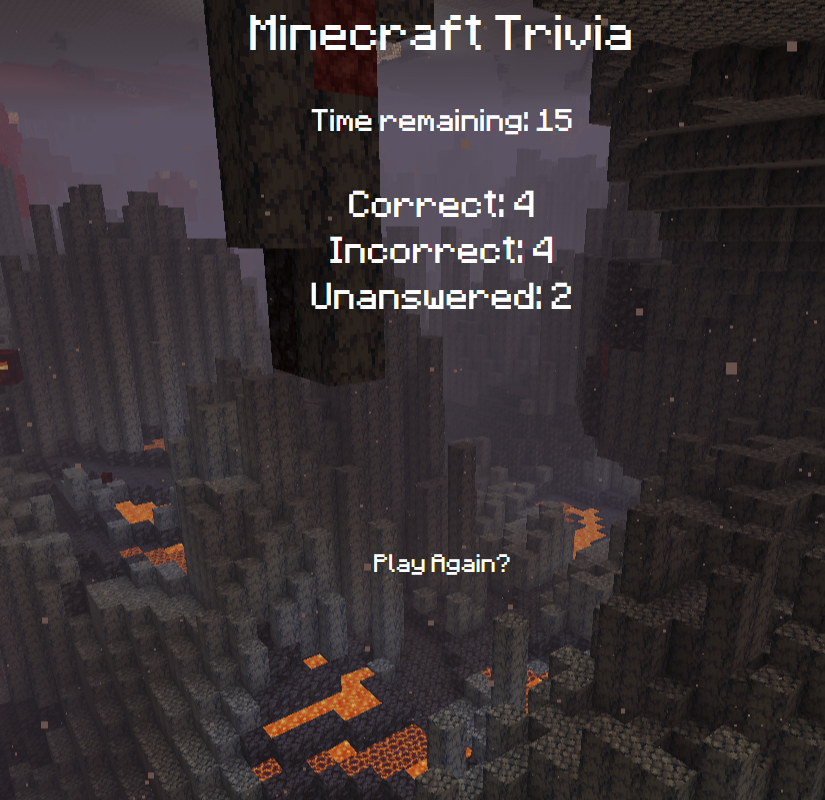

# Minecraft Trivia Game

Project Link: https://kennedyaustin.github.io/TriviaGame/

# Overview

-When the user clicks to start the game they will be given 15 seconds to read and answer each question that is shown on the page.
An image will be shown to the player that correlates with what the previous question asked them.  
  ● Timer  
    
-If the player gets the answer wrong text will be displayed on the screen that tells them the correct answer. If the player runs out of time, a similar function will run, but instead will tell the user that they ran out of time.  
  ● Running out of Time  
    
-At the end of the game the webpage will tally up the number of correct, incorrect, and unanswered questions and display them for the viewer to see before prompting them to play again.  
  ● Score/ Play Again  
    

# Tools Used

● HTML  
● Javascript/ JQuery  
● CSS 
